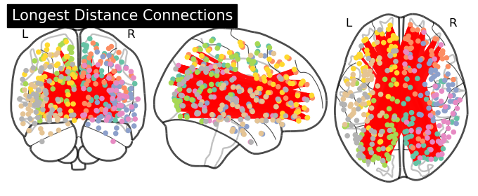
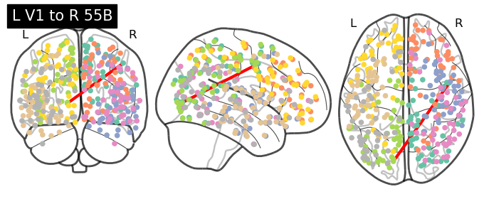

This readme contains saved output from Glasser_Distances.ipynb in this folder.

We want to calculate the distances between the centers of mass of each parcel in the Glasser (2016) atlas. 

To get the data, we are loosely following directions from the load_hcp ipynb at [NeuromatchAcademy](https://colab.research.google.com/github/NeuromatchAcademy/course-content/blob/main/projects/fMRI/load_hcp.ipynb#scrollTo=7cClEjP1FXdO). First, we download [hcp_rest.tgz](https://osf.io/j5kuc/download) and [atlas.npz](https://osf.io/j5kuc/download) from OSF. First, we extract the regions list using:

``` bash
tar -xzf hcp_rest.tgz hcp_rest/regions.npy
```

Then we load the data into python:

```python
# @title Setup and Load Data
import os
from scipy.spatial.distance import pdist, squareform
import nibabel as nib
import numpy as np
from nilearn import image, datasets, plotting
import os

HCP_DIR="./"
N_PARCELS = 360
TR = 0.72  # Time resolution, in sec
HEMIS = ["Right", "Left"]

dir = os.path.join(HCP_DIR, "hcp_rest")
regions = np.load(os.path.join(dir, "regions.npy")).T
region_names=regions[0].tolist()
print(region_names[:10])

with np.load(f"hcp_atlas.npz") as dobj:
  atlas = dict(**dobj)

print(atlas)

atlas['coords'].shape
```

    ['R_V1', 'R_MST', 'R_V6', 'R_V2', 'R_V3', 'R_V4', 'R_V8', 'R_4', 'R_3b', 'R_FEF']
    {'labels_R': array([ 54, 116,  50, ..., 134, 134, 134], dtype=int32), 'labels_L': array([233, 228, 220, ..., 301, 301, 306], dtype=int32), 'coords': array([[ 13.88705062, -79.36989109,   2.95539586],
           [ 43.31077929, -65.46435175,   3.65888316],
           [ 17.07818631, -76.27357601,  28.4532264 ],
           ...,
           [-43.66333418,  -6.4398113 , -15.54653597],
           [-10.61476522,  29.20779575,  26.91586381],
           [ -4.58484419,  34.61082077,  15.00143417]])}


    (360, 3)


Save labels and networks data:

```python
np.save("glasser_labels.npy",region_names)
np.save("glasser_networks.npy",regions[1])
with open(r'./glasser_labels.txt','w') as fp:
    fp.write('\n'.join(region_names))
with open(r'./glasser_networks.txt','w') as fp:
    fp.write('\n'.join(regions[1]))
```


```python
regions[1]
```


    array(['Visual1', 'Visual2', 'Visual2', 'Visual2', 'Visual2', 'Visual2',
           'Visual2', 'Somatomotor', 'Somatomotor', 'Cingulo-Oper',
           'Language', 'Default', 'Visual2', 'Frontopariet', 'Frontopariet',
           'Visual2', 'Visual2', 'Visual2', 'Visual2', 'Visual2', 'Visual2',
           'Visual2', 'Visual2', 'Auditory', 'Default', 'Default',
           'Dorsal-atten', 'Default', 'Frontopariet', 'Posterior-Mu',
           'Posterior-Mu', 'Posterior-Mu', 'Posterior-Mu', 'Posterior-Mu',
           'Posterior-Mu', 'Somatomotor', 'Cingulo-Oper', 'Cingulo-Oper',
           'Somatomotor', 'Somatomotor', 'Somatomotor', 'Somatomotor',
           'Cingulo-Oper', 'Cingulo-Oper', 'Cingulo-Oper', 'Language',
           'Somatomotor', 'Visual2', 'Visual2', 'Language', 'Somatomotor',
           'Somatomotor', 'Somatomotor', 'Somatomotor', 'Somatomotor',
           'Somatomotor', 'Cingulo-Oper', 'Cingulo-Oper', 'Cingulo-Oper',
           'Cingulo-Oper', 'Posterior-Mu', 'Posterior-Mu', 'Frontopariet',
           'Posterior-Mu', 'Posterior-Mu', 'Posterior-Mu', 'Posterior-Mu',
           'Posterior-Mu', 'Posterior-Mu', 'Posterior-Mu', 'Posterior-Mu',
           'Posterior-Mu', 'Frontopariet', 'Default', 'Default',
           'Posterior-Mu', 'Frontopariet', 'Cingulo-Oper', 'Default',
           'Frontopariet', 'Default', 'Frontopariet', 'Frontopariet',
           'Cingulo-Oper', 'Frontopariet', 'Cingulo-Oper', 'Posterior-Mu',
           'Posterior-Mu', 'Frontopariet', 'Posterior-Mu', 'Frontopariet',
           'Frontopariet', 'Posterior-Mu', 'Posterior-Mu', 'Language',
           'Language', 'Frontopariet', 'Frontopariet', 'Cingulo-Oper',
           'Somatomotor', 'Somatomotor', 'Somatomotor', 'Auditory',
           'Auditory', 'Cingulo-Oper', 'Cingulo-Oper', 'Auditory',
           'Cingulo-Oper', 'Cingulo-Oper', 'Orbito-Affec', 'Frontopariet',
           'Orbito-Affec', 'Cingulo-Oper', 'Cingulo-Oper', 'Somatomotor',
           'Language', 'Language', 'Posterior-Mu', 'Posterior-Mu',
           'Posterior-Mu', 'Visual1', 'Ventral-Mult', 'Default', 'Auditory',
           'Default', 'Posterior-Mu', 'Language', 'Default', 'Default',
           'Posterior-Mu', 'Posterior-Mu', 'Posterior-Mu', 'Frontopariet',
           'Posterior-Mu', 'Ventral-Mult', 'Language', 'Language', 'Visual2',
           'Default', 'Dorsal-atten', 'Dorsal-atten', 'Visual1', 'Language',
           'Frontopariet', 'Frontopariet', 'Language', 'Cingulo-Oper',
           'Cingulo-Oper', 'Frontopariet', 'Posterior-Mu', 'Posterior-Mu',
           'Visual2', 'Visual2', 'Visual2', 'Posterior-Mu', 'Visual2',
           'Visual2', 'Visual2', 'Visual2', 'Visual2', 'Posterior-Mu',
           'Posterior-Mu', 'Visual2', 'Posterior-Mu', 'Posterior-Mu',
           'Orbito-Affec', 'Cingulo-Oper', 'Somatomotor', 'Cingulo-Oper',
           'Frontopariet', 'Frontopariet', 'Default', 'Auditory', 'Auditory',
           'Auditory', 'Posterior-Mu', 'Posterior-Mu', 'Cingulo-Oper',
           'Cingulo-Oper', 'Cingulo-Oper', 'Visual1', 'Visual2', 'Visual2',
           'Visual2', 'Visual2', 'Visual2', 'Visual2', 'Somatomotor',
           'Somatomotor', 'Cingulo-Oper', 'Cingulo-Oper', 'Default',
           'Visual2', 'Frontopariet', 'Frontopariet', 'Visual2', 'Visual2',
           'Visual2', 'Visual2', 'Visual2', 'Visual2', 'Visual2', 'Visual2',
           'Auditory', 'Cingulo-Oper', 'Default', 'Dorsal-atten',
           'Dorsal-atten', 'Frontopariet', 'Posterior-Mu', 'Posterior-Mu',
           'Posterior-Mu', 'Posterior-Mu', 'Posterior-Mu', 'Posterior-Mu',
           'Somatomotor', 'Cingulo-Oper', 'Cingulo-Oper', 'Somatomotor',
           'Somatomotor', 'Somatomotor', 'Somatomotor', 'Cingulo-Oper',
           'Cingulo-Oper', 'Cingulo-Oper', 'Language', 'Somatomotor',
           'Visual2', 'Visual2', 'Language', 'Somatomotor', 'Somatomotor',
           'Somatomotor', 'Somatomotor', 'Somatomotor', 'Somatomotor',
           'Cingulo-Oper', 'Frontopariet', 'Cingulo-Oper', 'Cingulo-Oper',
           'Posterior-Mu', 'Frontopariet', 'Frontopariet', 'Posterior-Mu',
           'Posterior-Mu', 'Posterior-Mu', 'Posterior-Mu', 'Posterior-Mu',
           'Posterior-Mu', 'Posterior-Mu', 'Posterior-Mu', 'Posterior-Mu',
           'Frontopariet', 'Frontopariet', 'Default', 'Posterior-Mu',
           'Frontopariet', 'Cingulo-Oper', 'Default', 'Frontopariet',
           'Frontopariet', 'Cingulo-Oper', 'Frontopariet', 'Cingulo-Oper',
           'Frontopariet', 'Cingulo-Oper', 'Posterior-Mu', 'Posterior-Mu',
           'Frontopariet', 'Posterior-Mu', 'Frontopariet', 'Frontopariet',
           'Frontopariet', 'Posterior-Mu', 'Language', 'Language',
           'Frontopariet', 'Frontopariet', 'Cingulo-Oper', 'Somatomotor',
           'Somatomotor', 'Somatomotor', 'Auditory', 'Somatomotor',
           'Cingulo-Oper', 'Cingulo-Oper', 'Auditory', 'Cingulo-Oper',
           'Cingulo-Oper', 'Orbito-Affec', 'Frontopariet', 'Orbito-Affec',
           'Cingulo-Oper', 'Cingulo-Oper', 'Somatomotor', 'Language',
           'Language', 'Posterior-Mu', 'Posterior-Mu', 'Posterior-Mu',
           'Visual1', 'Ventral-Mult', 'Default', 'Auditory', 'Default',
           'Posterior-Mu', 'Language', 'Posterior-Mu', 'Default',
           'Posterior-Mu', 'Posterior-Mu', 'Posterior-Mu', 'Frontopariet',
           'Posterior-Mu', 'Ventral-Mult', 'Language', 'Language', 'Visual2',
           'Default', 'Dorsal-atten', 'Dorsal-atten', 'Visual1', 'Language',
           'Frontopariet', 'Frontopariet', 'Language', 'Cingulo-Oper',
           'Cingulo-Oper', 'Frontopariet', 'Posterior-Mu', 'Posterior-Mu',
           'Visual2', 'Visual2', 'Visual2', 'Posterior-Mu', 'Visual2',
           'Visual2', 'Visual2', 'Visual2', 'Visual2', 'Posterior-Mu',
           'Frontopariet', 'Visual2', 'Posterior-Mu', 'Posterior-Mu',
           'Orbito-Affec', 'Cingulo-Oper', 'Somatomotor', 'Cingulo-Oper',
           'Frontopariet', 'Frontopariet', 'Default', 'Auditory', 'Auditory',
           'Auditory', 'Posterior-Mu', 'Frontopariet', 'Cingulo-Oper',
           'Cingulo-Oper', 'Cingulo-Oper'], dtype='<U12')


# Distance Calculation

We get distances using numpy and save to a file.


```python
distances = np.array([ np.linalg.norm(atlas['coords']-p, axis=1) for p in atlas['coords']])

print(distances.shape)
np.save("glasserdistances.npy",distances)
np.savetxt("glasserdistances.txt",distances,delimiter=',')

```

    (360, 360)


# QC

We'll create a 0-1 scaled matrix just for illustration. The 'connectome' plot of the resulting chords is just the longest possible distance connections, exactly as we'd think.


```python
normdistances=(distances-np.min(distances))/(np.max(distances)-np.min(distances))

plotting.plot_connectome(normdistances, atlas["coords"], edge_threshold="99.5%",title="Longest Distance Connections",node_size=20)
```


    <nilearn.plotting.displays._projectors.OrthoProjector at 0x7fb9ba3516d0>


    

    


We want to make sure that the order didn't get messed up somehow. Let's draw L V1 to R 55b (which is roughly in middle frontal gyrus, close to the motor cortex).


```python
empty=np.zeros((360,360))
I1=region_names.index("L_V1")
I2=region_names.index("R_55b")
empty[(I1,I2)]=1
empty[(I2,I1)]=1
plotting.plot_connectome(empty, atlas["coords"], edge_threshold="99.5%",title="L V1 to R 55B",node_size=20)
```


    <nilearn.plotting.displays._projectors.OrthoProjector at 0x7fb9b1420390>


    

    

