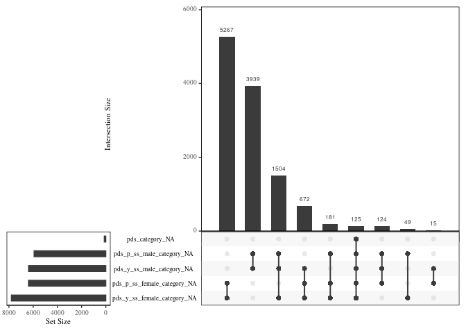
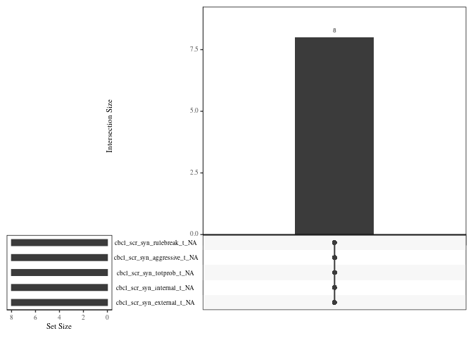
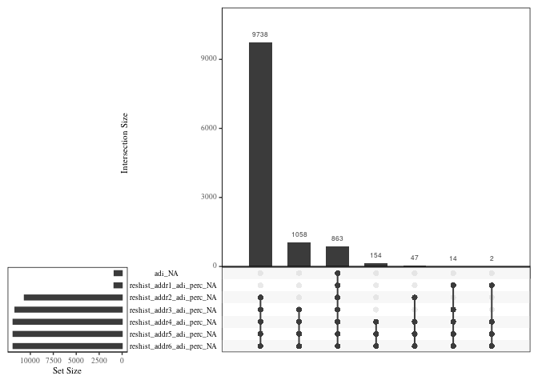
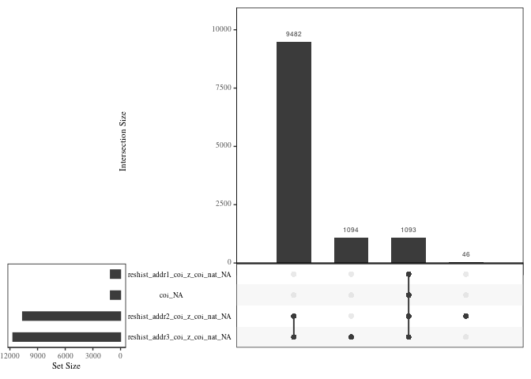

```{=html}
<style type="text/css">
 img {   background-color: transparent;   border: 0; }  .st-table td, .st-table th {   padding: 8px; }  .st-table > thead > tr {    background-color: #eeeeee; }  .st-cross-table td {   text-align: center; }  .st-descr-table td {   text-align: right; }  table.st-table th {   text-align: center; }  table.st-table > thead > tr {    background-color: #eeeeee; }  table.st-table td span {   display: block; }  table.st-table > tfoot > tr > td {   border:none; }  .st-container {   width: 100%;   padding-right: 15px;   padding-left: 15px;   margin-right: auto;   margin-left: auto;   margin-top: 15px; }  .st-multiline {   white-space: pre; }  .st-table {     width: auto;     table-layout: auto;     margin-top: 20px;     margin-bottom: 20px;     max-width: 100%;     background-color: transparent;     border-collapse: collapse; }  .st-table > thead > tr > th, .st-table > tbody > tr > th, .st-table > tfoot > tr > th, .st-table > thead > tr > td, .st-table > tbody > tr > td, .st-table > tfoot > tr > td {   vertical-align: middle; }  .st-table-bordered {   border: 1px solid #bbbbbb; }  .st-table-bordered > thead > tr > th, .st-table-bordered > tbody > tr > th, .st-table-bordered > thead > tr > td, .st-table-bordered > tbody > tr > td {   border: 1px solid #cccccc; }  .st-table-bordered > thead > tr > th, .st-table-bordered > thead > tr > td, .st-table thead > tr > th {   border-bottom: none; }  .st-freq-table > thead > tr > th, .st-freq-table > tbody > tr > th, .st-freq-table > tfoot > tr > th, .st-freq-table > thead > tr > td, .st-freq-table > tbody > tr > td, .st-freq-table > tfoot > tr > td, .st-freq-table-nomiss > thead > tr > th, .st-freq-table-nomiss > tbody > tr > th, .st-freq-table-nomiss > tfoot > tr > th, .st-freq-table-nomiss > thead > tr > td, .st-freq-table-nomiss > tbody > tr > td, .st-freq-table-nomiss > tfoot > tr > td, .st-cross-table > thead > tr > th, .st-cross-table > tbody > tr > th, .st-cross-table > tfoot > tr > th, .st-cross-table > thead > tr > td, .st-cross-table > tbody > tr > td, .st-cross-table > tfoot > tr > td {   padding-left: 20px;   padding-right: 20px; }  .st-table-bordered > thead > tr > th, .st-table-bordered > tbody > tr > th, .st-table-bordered > thead > tr > td, .st-table-bordered > tbody > tr > td {   border: 1px solid #cccccc; }  .st-table-striped > tbody > tr:nth-of-type(odd) {   background-color: #ffffff; }  .st-table-striped > tbody > tr:nth-of-type(even) {   background-color: #f9f9f9; }  .st-descr-table > thead > tr > th, .st-descr-table > tbody > tr > th, .st-descr-table > thead > tr > td, .st-descr-table > tbody > tr > td {   padding-left: 24px;   padding-right: 24px;   word-wrap: break-word; }  .st-freq-table, .st-freq-table-nomiss, .st-cross-table {   border: medium none; }  .st-freq-table > thead > tr:nth-child(1) > th:nth-child(1), .st-cross-table > thead > tr:nth-child(1) > th:nth-child(1), .st-cross-table > thead > tr:nth-child(1) > th:nth-child(3) {   border: none;   background-color: #ffffff;   text-align: center; }  .st-protect-top-border {   border-top: 1px solid #cccccc !important; }  .st-ws-char {   display: inline;   color: #999999;   letter-spacing: 0.2em; }  /* Optional classes */ .st-small {   font-size: 13px; }  .st-small td, .st-small th {   padding: 8px; }  .st-small > thead > tr > th, .st-small > tbody > tr > th, .st-small > thead > tr > td, .st-small > tbody > tr > td {   padding-left: 12px;   padding-right: 12px; } .table {   width: auto; }  .table > tbody > tr > td {   vertical-align: middle; } </style>
```
# Appendix A: ABCD Tabulated Data Import

We are extracting the following data structures:

``` r
cat(readLines('ExtractList.txt'), sep = '\n')
```

    TabulatedData/abcd_rhds01.txt
    TabulatedData/abcd_ptsd01.txt
    TabulatedData/pdem02.txt
    TabulatedData/acspsw03.txt
    TabulatedData/abcd_ssphy01.txt
    TabulatedData/abcd_ssphp01.txt
    TabulatedData/abcd_cbcls01.txt
    TabulatedData/abcd_ps01.txt
    TabulatedData/abcd_tbss01.txt
    TabulatedData/abcd_lt01.txt

## Import and Recode by table

``` r
docnrows=-1 # set to -1 for the full dataset.
# The default argument for 'path' should be set to where you saved your ABCD
# data tables.
read_abcd<-function(datafile,path="/mnt/box/ABCD_tabulated_data/TabulatedData") {
  header_a <- read.table(
    file.path(path,datafile),
    nrows = 1,
    header = FALSE,
    na.strings = c("777","999"),
    stringsAsFactors = FALSE
  )
  # Skip the 2nd line (variable description)
  a <- read.table(
    file.path(path,datafile),
    skip = 2,
    nrows = docnrows,
    sep = "\t",
    comment.char = "",
    quote = "\"",
    header = FALSE
  )
  colnames(a) <- unlist(header_a)
  
  a <- as.data.frame(sapply(a, function(x) {
    gsub("\"", "", x)
  }))
  names(a) <- as.list(sapply(names(a), function(x) {
    gsub("\"", "", x)
  }))
  a %>% select(-collection_title)
}

#Sum inclusive: returns NA if all values NA, otherwise uses na.rm
sum_i = function(...) {
  x<-c(...)
  if (all(is.na(x))) x[NA_real_] else sum(x, na.rm = TRUE)
}

subtables<-list()

cheaders=c("subjectkey","interview_date","interview_age","sex","eventname")
```

We are not doing our own scoring on any instrument, so we do not have to
make our own missing data rules.

### Neighborhood Factors -- abcd_rhds01

Notably, Taylor et. al. 2020 took issue with some of the loadings used
in calculating the ADI (which are draw from a prior work), but others
use the original (and provided) loadings. Taylor was concerned that the
ADI incorporated median income, but we believe it is worth including. We
will take a weighted average per address. So, we need time spent at each
address as well as the ADI. We will use the national percentile rank
score for ADI (e.g., reshist_addr1_adi_perc). Time spent per address is
given as a %-ile (e.g., reshist_addr1_percentile).

We will also include COI-2, which (as opposed to the first version), is
comparable across neighborhoods (e.g., reshist_addr1_coi_z\_coi_nat).

Update: very few participants (\< 200) reported percentage spent at
second and third addresses, making it impossible to take a weighted
average. More than 11000 participants reported only one address. We will
simply average across all reported addresses, which will handle some
missing data cases.

``` r
subtables$rhds <- read_abcd("abcd_rhds01.txt") %>%
  filter(eventname == "baseline_year_1_arm_1") %>%
  select(c(any_of(cheaders),
           ends_with("_adi_perc"),
           ends_with("coi_z_coi_nat"))) %>%
  mutate(
    across(reshist_addr1_adi_perc:reshist_addr3_coi_z_coi_nat, as.numeric)
    ) %>% 
  mutate(
      adi = rowMeans(select(.,ends_with("adi_perc")),na.rm=TRUE),
    coi = rowMeans(select(.,ends_with("coi_nat")),na.rm=TRUE)
  )
```

### Trauma Exposure -- ptsd01

Criterion A questionnaire from the KSADS. This is count data, so missing
items will simply be omitted from the score.

``` r
subtables$ptsd01 <- read_abcd("abcd_ptsd01.txt") %>%
  select(c(any_of(cheaders),ksads_ptsd_raw_754_p:ksads_ptsd_raw_770_p)) %>% 
  filter(eventname == "baseline_year_1_arm_1") %>%
  mutate(across(ksads_ptsd_raw_754_p:ksads_ptsd_raw_770_p,as.numeric)) %>%
  mutate(ksads_count=rowSums(select(.,starts_with("ksads_ptsd_raw")),na.rm=TRUE),
         ksads_factor=factor(case_when(ksads_count == 0 ~ "0",
                                  ksads_count == 1 ~ "1",
                                  ksads_count >= 2 ~ ">2",
                                  TRUE ~ NA_character_)))

# Missing values are omitted, but rows where the instrument is completely missing
# will remain missing

#reorder:
subtables$ptsd01$ksads_factor<-factor(subtables$ptsd01$ksads_factor,levels=c("0","1",">2"))
```

### Demographics

#### pdem02

``` r
# Function to recode education variable
edcoding<-function(x) {
  x<-as.numeric(x)
  factor(case_when(x < 13 ~ 1,
            x < 15 ~ 2,
            x < 18 ~ 3,
            x < 19 ~ 4,
            x <= 21 ~ 5,
            x == 777 ~ NA_real_,
            x == 999 ~ NA_real_),
         levels=1:5,
         labels=c("< HS",
                  "HS Graduate",
                  "Some College",
                  "College Degree",
                  "Graduate Degree"),
         ordered=TRUE)
}

qmax<- function(x) { # We use this to suppress a warning when all values are NA.
  if(all(is.na(x))) {return(NA)}
  max(x,na.rm=TRUE)
}

# Function to recode education variable without collapsing bins.
edcoding_full <- function(x) {
  factor(
    case_when(
      x == "777" ~ NA_real_,
      x == "999" ~ NA_real_,
      is.na(x) ~ NA_real_,
      TRUE ~ as.numeric(x)
    ),
    levels = 0:21,
    labels = c(
      "Never attended/Kindergarten only",
      "1st grade",
      "2nd grade",
      "3rd grade",
      "4th grade",
      "5th grade",
      "6th grade",
      "7th grade",
      "8th grade",
      "9th grade",
      "10th grade",
      "11th grade",
      "12th grade",
      "High school graduate",
      "GED or equivalent",
      "Some college",
      "Associate degree: Occupational",
      "Associate degree: Academic Program",
      "Bachelor degree",
      "Master degree",
      "Professional School",
      "Doctoral Degree"
    ),
    ordered = TRUE
  )
}

subtables$pdem02 <- read_abcd("pdem02.txt") %>%
  filter(eventname == "baseline_year_1_arm_1") %>%
  select(
    c(
      any_of(cheaders),
      eventname,
      demo_comb_income_v2,
      demo_prnt_ed_v2,
      demo_prtnr_ed_v2,
      demo_race_a_p___10:demo_ethn2_v2
    )
  ) %>%
  # Factorize Income (full)
  mutate(
    demo_comb_income_v2=as.numeric(demo_comb_income_v2),
    household.income.full = factor(
      case_when(
        demo_comb_income_v2 == 1  ~ "Less than $5,000",
        demo_comb_income_v2 == 2  ~ "$5,000 through $11,999",
        demo_comb_income_v2 == 3  ~ "$12,000 through $15,999",
        demo_comb_income_v2 == 4  ~ "$16,000 through $24,999",
        demo_comb_income_v2 == 5  ~ "$25,000 through $34,999",
        demo_comb_income_v2 == 6  ~ "$35,000 through $49,999",
        demo_comb_income_v2 == 7  ~ "$50,000 through $74,999",
        demo_comb_income_v2 == 8  ~ "$75,000 through $99,999",
        demo_comb_income_v2 == 9  ~ "$100,000 through $199,999",
        demo_comb_income_v2 == 10 ~ "$200,000 and greater",
        TRUE ~ NA_character_
      )
    ),
    # Recode
    household.income = factor(
      case_when(
        demo_comb_income_v2 <= 4 ~ "$0 to $25k",
        demo_comb_income_v2 <= 6 ~ "$25k to $50k",
        demo_comb_income_v2 <= 7 ~ "$50k to $75k",
        demo_comb_income_v2 == 8 ~ "$75k to $100k",
        demo_comb_income_v2 == 9 ~ "$100k to $200k",
        demo_comb_income_v2 == 10 ~ "Over $200k",
        TRUE ~ NA_character_
      )
    )
  ) %>%
  mutate(across(demo_race_a_p___10:demo_ethn_v2, as.numeric)) %>%
  # Give Race/Ethnicity Vars legible names
  rename(race.iden.note = demo_race_notes_v2) %>%
  rename(ethn.iden.hisp = demo_ethn_v2) %>%
  rename(ethn.iden.hisp.which = demo_ethn2_v2) %>%
  # Recode Ethnicity
  mutate(
    ethn.iden.hisp = case_when(ethn.iden.hisp == 1 ~ 1,
                               ethn.iden.hisp == 2 ~ 0,
                               TRUE ~ NA_real_),
    ethn.iden.hisp.which = factor(
      ethn.iden.hisp.which,
      levels = c(10, 12, 13, 14, 15, 18, 19, 20, 40, 41),
      labels = c(
        "Puerto Rican",
        "Dominican",
        "Mexican",
        "Mexican American",
        "Chicano",
        "Cuban",
        "Cuban American",
        "Central or South American",
        "Other Latin American",
        "Other Hispanic"
      )
    )
  ) %>%
  rename(
    "race.iden.white" = "demo_race_a_p___10",
    "race.iden.black" = "demo_race_a_p___11",
    "race.iden.americanindian" = "demo_race_a_p___12",
    "race.iden.alaskanative" = "demo_race_a_p___13",
    "race.iden.nativehawaiian" = "demo_race_a_p___14",
    "race.iden.guamanian" = "demo_race_a_p___15",
    "race.iden.samoan" = "demo_race_a_p___16",
    "race.iden.opacificislander" = "demo_race_a_p___17",
    "race.iden.asianindian" = "demo_race_a_p___18",
    "race.iden.filipino" = "demo_race_a_p___19",
    "race.iden.chinese" = "demo_race_a_p___20",
    "race.iden.japanese" = "demo_race_a_p___21",
    "race.iden.korean" = "demo_race_a_p___22",
    "race.iden.vietnamese" = "demo_race_a_p___23",
    "race.iden.otherasian" = "demo_race_a_p___24",
    "race.iden.other" = "demo_race_a_p___25",
    "race.iden.refuse" = "demo_race_a_p___77",
    "race.iden.dontknow" = "demo_race_a_p___99"
  ) %>% 
rowwise() %>%
  # Calculate max parent education
  mutate(
    p.edu = max(
      edcoding(demo_prnt_ed_v2),
      edcoding(demo_prtnr_ed_v2),
      na.rm = TRUE
    ),
    p.edu.full = max(
      edcoding_full(demo_prnt_ed_v2),
      edcoding_full(demo_prtnr_ed_v2),
      na.rm = TRUE
    )
  )

subtables$pdem02$household.income<-factor(subtables$pdem02$household.income,levels=c("$0 to $25k",
                                                         "$25k to $50k",
                                                         "$50k to $75k",
                                                         "$75k to $100k",
                                                         "$100k to $200k",
                                                         "Over $200k"))
```

#### acspsw -- Family ID, derived race, propensity weights

A 5 category, census compatible, derived race variable is present in the
weights table. This table also includes the family ID.

``` r
subtables$acspsw <- read_abcd("acspsw03.txt") %>%
  filter(eventname == "baseline_year_1_arm_1") %>%
  select(c(any_of(cheaders),
           race_ethnicity,
           rel_family_id,
           acs_raked_propensity_score)) %>% 
  mutate(race_ethnicity.factor = factor(race_ethnicity,
                                        levels=1:5,
                                        labels = c("White",
                                                   "Black",
                                                   "Hispanic",
                                                   "Asian",
                                                   "Other")),
         acs_raked_propensity=as.numeric(acs_raked_propensity_score))
#race_ethnicity
#rel_family_id
```

### Pubertal Development (abcd_ssphy01)

We need:

-   pds_y\_ss_female_category
-   pds_c\_ss_female_category
-   pds_y\_ss_male_category
-   pds_c\_ss_male_category

``` r
ssphy01 <- read_abcd("abcd_ssphy01.txt") %>%
  filter(eventname == "baseline_year_1_arm_1") %>%
  mutate(across(pds_y_ss_male_category:pds_y_ss_male_cat_2_nt,as.numeric)) %>%
  select(c(any_of(cheaders),pds_y_ss_male_category,pds_y_ss_female_category))

ssphp01 <- read_abcd("abcd_ssphp01.txt") %>%
  filter(eventname == "baseline_year_1_arm_1") %>%
  mutate(across(sds_p_ss_dims:pds_p_ss_male_cat_2_nt,as.numeric)) %>%
  select(c(any_of(cheaders),pds_p_ss_male_category,pds_p_ss_female_category))

pcombine<-full_join(ssphy01,ssphp01)
```

    ## Joining with `by = join_by(subjectkey, interview_date, interview_age, sex,
    ## eventname)`

``` r
pcombine <- pcombine %>% mutate(
  pds_category=case_when(!is.na(pds_p_ss_female_category) ~ pds_p_ss_female_category,
                         !is.na(pds_p_ss_male_category) ~ pds_p_ss_male_category,
                         !is.na(pds_y_ss_female_category) ~ pds_y_ss_female_category,
                         !is.na(pds_y_ss_male_category) ~ pds_y_ss_male_category,
                         TRUE ~ NA_real_)) %>% 
  mutate(pds_category=factor(pds_category,
                             levels = 1:5,
                             labels=c("pre-pubertal",
                                      "early puberty",
                                      "mid puberty",
                                      "late puberty",
                                      "post pubertal")))

# Before we composite -- what are the missingness conditions?
gg_miss_upset(pcombine %>% select(starts_with("pds")))
```



``` r
# There are missing values, for each birth sex, where nothing is available, and
# where either parent or child report is not available. This code will need to 
# be revised if any participant has both male and female pdp data.

subtables$pcombine<-pcombine
rm(ssphp01,ssphy01,pcombine)
```

### CBCL and p factor -- cbcls01

CBCL (parent report) summary scores Here we read CBCL summary data. P
factor, INT, and EXT are calculated as in Brislin (2021). The t scored
subscales are used. All sub-scales load on to a general p factor. EXT is
constructed from delinquent and aggressive behavior scales. The INT
specific factor included the withdrawn, somatic complaints, and
anxious/depressed scales. The CBCL has its own missing data rules so we
need not use our own.

``` r
cbcls<- read_abcd("abcd_cbcls01.txt") %>%
  filter(eventname == "baseline_year_1_arm_1") %>%
  mutate(across(ends_with(c("_r","_t","_nm")),as.numeric)) %>% 
  select(c(any_of(cheaders),
           cbcl_scr_syn_anxdep_t,
           cbcl_scr_syn_withdep_t,
           cbcl_scr_syn_somatic_t,
           cbcl_scr_syn_social_t,
           cbcl_scr_syn_thought_t,
           cbcl_scr_syn_attention_t,
           cbcl_scr_syn_rulebreak_t,
           cbcl_scr_syn_aggressive_t,
           cbcl_scr_syn_totprob_t,
           cbcl_scr_syn_internal_t,
           cbcl_scr_syn_external_t))

#check for missing data problems
if(any(is.na(cbcls %>% select(starts_with("cbcl_scr"))))) {
  cbcls %>% select(starts_with("cbcl_scr")) %>% 
    as_shadow_upset() %>% upset()
  } else {
    print("No missing CBCL values found.")
  }
```



``` r
p.model <- '
pfactor         =~ cbcl_scr_syn_anxdep_t + cbcl_scr_syn_withdep_t + cbcl_scr_syn_somatic_t + cbcl_scr_syn_social_t + cbcl_scr_syn_thought_t + cbcl_scr_syn_attention_t + cbcl_scr_syn_rulebreak_t + cbcl_scr_syn_aggressive_t
INT             =~ cbcl_scr_syn_anxdep_t + cbcl_scr_syn_withdep_t + cbcl_scr_syn_somatic_t
EXT             =~ cbcl_scr_syn_rulebreak_t + cbcl_scr_syn_aggressive_t
pfactor         ~~ 0*INT
pfactor         ~~ 0*EXT
INT             ~~ 0*EXT
'

p.modelfit <- cfa(p.model, data = cbcls, information="observed")
cfapreds<-as.data.frame(lavPredict(p.modelfit))
cfapreds$lavaanid<-inspect(p.modelfit,"case.idx")

cbcls$lavaanid<-1:nrow(cbcls)
subtables$cbcls <- cbcls %>%
  full_join(cfapreds,by="lavaanid") %>% 
  select(c(any_of(cheaders),
           cbcl_scr_syn_anxdep_t:cbcl_scr_syn_external_t,
           pfactor:EXT))
```

### Cognitive Functioning

There are many approaches to modeling general cognitive ability in ABCD.
Sripada (2021) validated and used a bifactor model with the following
measures (sorted by factor):

-   Verbal/Spatial:
    -   WISC Vocabulary
    -   WISC Reading
    -   WISC Working Memory
    -   WISC Matrix Reasoning
    -   WISC Spatial Rotation
-   Speed/Flexibility:
    -   Flanker Task
    -   Card Sort
    -   Processing Speed
-   Learning/Memory:
    -   Memory Short Delay
    -   Memory Long Delay
    -   Episodic Memory

However, we don't know much about how they scored this, (scaled or raw,
how did they score flanker, etc.)

Clark et al. cites Sripada but did something different: "General
cognitive ability (GCA) scores were computed by fitting a bifactor model
to behavioral tasks from the National Institutes of Health toolbox; the
Rey Auditory Verbal Learning Task; the Weschler Intelligence Scale for
Children, fifth edition; and the "Little Man" task (for more details on
the GCA variables, see Sripada, Angstadt, Rutherford, & Taxali, 2020)."

Marek et al. (2019) used the 'cognition composite' score from the NIH
toolbox cognition battery.

Thompson et al. uses a bayesian probabilistic principal components
analysis to get a 3 factor model. However, they did not use the whole
sample. Ultimately, we are not interested in the factor structure of
cognition and are better served by using well established single indices
of cognition. Thus, we will use two better validated measures: the
scaled score from the WISC-V matrix reasoning task and the cognition
composite score from the NIH toolbox cognition battery.

#### ps01

This Table contains results from Pearson Instruments. We just want
matrix reasoning.

``` r
subtables$ps01 <- read_abcd("abcd_ps01.txt") %>%
  filter(eventname == "baseline_year_1_arm_1") %>%
  mutate(across(pea_ravlt_sd_trial_i_tc:pea_wiscv_item_32_rs,as.numeric)) %>%
  select(c(any_of(cheaders),pea_wiscv_tss))
```

#### tbss01

NIH toolbox data. We want the Flanker task data (as a measure of
inhibition), the general crystal intelligence score, and the general
cognitive score.

``` r
subtables$tbss01 <- read_abcd("abcd_tbss01.txt") %>%
  filter(eventname == "baseline_year_1_arm_1") %>% 
  select(c(any_of(cheaders),
           nihtbx_flanker_agecorrected,
           nihtbx_cryst_agecorrected,
           nihtbx_totalcomp_agecorrected)) %>%
  mutate(across(nihtbx_flanker_agecorrected:nihtbx_totalcomp_agecorrected,as.numeric))
```

### Site

site_id_l is in longitudinal tracking instrument

``` r
subtables$lt01<- read_abcd("abcd_lt01.txt") %>%
  filter(eventname == "baseline_year_1_arm_1") %>% 
  select(c(any_of(cheaders),site_id_l)) %>% 
  mutate(site_id_l=as_factor(site_id_l))
```

### Image Control Data

mriqcrp10301 contains basic QC information about T1 and rsfmri which are
used to determine eligibility for the tabulated data.

``` r
subtables$mriiqc<-read_abcd("mriqcrp10301.txt") %>%
  filter(eventname == "baseline_year_1_arm_1") %>% 
  select(c(any_of(cheaders),
           iqc_t1_total_ser,
           iqc_t1_ok_ser,
           iqc_rsfmri_ok_tr,
           iqc_rsfmri_ok_ser,
           iqc_rsfmri_total_ser)) %>%
  mutate(t1_received=iqc_t1_total_ser>0,
         rsfmri_received=iqc_rsfmri_total_ser>0,
         t1_minok=iqc_t1_ok_ser>0,
         rsfmri_minok=iqc_rsfmri_ok_ser>0)
```

An additional table, mri_imgincl, has DAIC's recommendations about
exclusions.

``` r
subtables$imgincl <- read_abcd("abcd_imgincl01.txt")  %>%
  filter(eventname == "baseline_year_1_arm_1") %>%
  select(subjectkey, imgincl_t1w_include, imgincl_rsfmri_include) %>%
  mutate(across(starts_with("imgincl"), \(x) {x==1})) %>%
  mutate(imgincl=imgincl_t1w_include & imgincl_rsfmri_include)
```

### BMI

``` r
subtables$ant01<- read_abcd("abcd_ant01.txt") %>%
  filter(eventname == "baseline_year_1_arm_1") %>% 
  select(c(any_of(cheaders),anthroheightcalc,ends_with("lb"))) %>%
  mutate(across(anthroheightcalc:anthroweight3lb,~as.numeric(.))) %>% 
  # data dictionary gives a qualitative description of this calculation, as well 
  # as a formula. They are not the same. This is adaptation of the formula.
  mutate(anthroweightcalc=rowMeans(select(.,c(anthroweight1lb,anthroweight2lb,anthroweight3lb)),na.rm=TRUE),
         bmi=703*anthroweightcalc/anthroheightcalc^2)
```

### Scanner

``` r
subtables$scanner<-read_abcd("abcd_mri01.txt") %>% 
  filter(eventname == "baseline_year_1_arm_1") %>% 
  select(c(any_of(cheaders),mri_info_manufacturer,mri_info_manufacturersmn)) %>% 
  mutate(mri_manu=as.factor(mri_info_manufacturer),
         mri_model=as.factor(mri_info_manufacturersmn))
```

## Merge Tabulated Data

``` r
tabfull <- Reduce(function(x, y) full_join(x, y), subtables)
```

    ## Joining with `by = join_by(subjectkey, interview_date, interview_age, sex,
    ## eventname)`
    ## Joining with `by = join_by(subjectkey, interview_date, interview_age, sex,
    ## eventname)`
    ## Joining with `by = join_by(subjectkey, interview_date, interview_age, sex,
    ## eventname)`
    ## Joining with `by = join_by(subjectkey, interview_date, interview_age, sex,
    ## eventname)`
    ## Joining with `by = join_by(subjectkey, interview_date, interview_age, sex,
    ## eventname)`
    ## Joining with `by = join_by(subjectkey, interview_date, interview_age, sex,
    ## eventname)`
    ## Joining with `by = join_by(subjectkey, interview_date, interview_age, sex,
    ## eventname)`
    ## Joining with `by = join_by(subjectkey, interview_date, interview_age, sex,
    ## eventname)`
    ## Joining with `by = join_by(subjectkey, interview_date, interview_age, sex,
    ## eventname)`
    ## Joining with `by = join_by(subjectkey)`
    ## Joining with `by = join_by(subjectkey, interview_date, interview_age, sex,
    ## eventname)`
    ## Joining with `by = join_by(subjectkey, interview_date, interview_age, sex,
    ## eventname)`

## Tabulated Data Integrity

For each of our constructs, we should check whether the coding is
correct (i.e., how the data is transformed from the original) and
whether the variables are typed correctly (i.e., string, numeric,
factor). Simultaneously, we will make a list of columns to be included
in the final dataframe.

### ID and Common Variables

``` r
tabfull<- tabfull %>% mutate(
  subjectkey=as.factor(subjectkey),
  interview_date=as.Date(interview_date,format="%m/%d/%Y"),
  interview_age=as.integer(interview_age),
  sex=as.factor(sex)
)

tabcols<-list()
tabcols$id<-c("subjectkey","interview_date","interview_age","sex")
```

### Data Frame Summary

#### tabfull

**Dimensions:** 11876 x 4\
**Duplicates:** 0

  -------------------------------------------------------------------------------------
  Variable          Stats / Values      Freqs (% of     Graph                 Missing
                                        Valid)                                
  ----------------- ------------------- --------------- --------------------- ---------
  subjectkey\       1\.                 1 ( 0.0%)\      \                     0\
  \[factor\]        NDAR_INV***REMOVED***\   1 ( 0.0%)\      \                     (0.0%)
                    2.                  1 ( 0.0%)\      \                     
                    NDAR_INV***REMOVED***\   1 ( 0.0%)\      \                     
                    3.                  1 ( 0.0%)\      \                     
                    NDAR_INV***REMOVED***\   1 ( 0.0%)\      \                     
                    4.                  1 ( 0.0%)\      \                     
                    NDAR_INV***REMOVED***\   1 ( 0.0%)\      \                     
                    5.                  1 ( 0.0%)\      \                     
                    NDAR_INV***REMOVED***\   1 ( 0.0%)\      \                     
                    6.                  11866 (99.9%)   IIIIIIIIIIIIIIIIIII   
                    NDAR_INV***REMOVED***\                                         
                    7.                                                        
                    NDAR_INV***REMOVED***\                                         
                    8.                                                        
                    NDAR_INV***REMOVED***\                                         
                    9.                                                        
                    NDAR_INV***REMOVED***\                                         
                    10.                                                       
                    NDAR_INV***REMOVED***\                                         
                    \[ 11866 others \]                                        

  interview_date\   min : 2016-09-01\   756 distinct          . : .   .\      0\
  \[Date\]          med : 2017-11-06\   values              . : : : : : : :\  (0.0%)
                    max : 2018-10-15\                       : : : : : : : :\  
                    range : 2y 1m 14d                     : : : : : : : : :\  
                                                        : : : : : : : : : :   

  interview_age\    Mean (sd) : 119     27 distinct     :\                    0\
  \[integer\]       (7.5)\              values          : :   : :   :   :\    (0.0%)
                    min \< med \< max:\                 : : . : : . : . : .\  
                    107 \< 119 \< 133\                  : : : : : : : : : :\  
                    IQR (CV) : 14 (0.1)                 : : : : : : : : : :   

  sex\              1\. F\              5680 (47.8%)\   IIIIIIIII\            0\
  \[factor\]        2. M                6196 (52.2%)    IIIIIIIIII            (0.0%)
  -------------------------------------------------------------------------------------

There are 0 duplicated subject keys.

### ADI + COI

Let's check one rows for each pattern of missingness in the data (i.e.,
pattern of reported addresses)

``` r
adicalc <- tabfull %>% select(c(ends_with("adi_perc"),adi)) %>%
  rename_all(~stringr::str_replace(.,"^reshist_addr","a")) %>% #for brevity
  mutate(across(.fns = list(miss = ~is.na(.)))) %>%
  distinct(across(ends_with("_miss")),.keep_all=TRUE) %>%
  select(-ends_with("_miss"))
```

    ## Warning: There was 1 warning in `mutate()`.
    ## ℹ In argument: `across(.fns = list(miss = ~is.na(.)))`.
    ## Caused by warning:
    ## ! Using `across()` without supplying `.cols` was deprecated in dplyr 1.1.0.
    ## ℹ Please supply `.cols` instead.

``` r
coicalc <- tabfull %>% select(c(ends_with("coi_nat"),coi)) %>%
  rename_all(~stringr::str_replace(.,"^reshist_addr","a")) %>% #for brevity
  mutate(across(.fns = list(miss = ~is.na(.)))) %>%
  distinct(across(ends_with("_miss")),.keep_all=TRUE) %>%
  select(-ends_with("_miss"))

gg_miss_upset(tabfull %>% select(c(ends_with("adi_perc"),adi)),nsets=7)
```



``` r
#pander(adicalc,caption="Example ADI calculations: All Missingness Profiles")
adicalc
```

    ##   a1_adi_perc a2_adi_perc a3_adi_perc a4_adi_perc a5_adi_perc a6_adi_perc
    ## 1          24          NA          NA          NA          NA          NA
    ## 2          NA          NA          NA          NA          NA          NA
    ## 3          25          25          NA          NA          NA          NA
    ## 4           5          NA           6          NA          NA          NA
    ## 5          33          38          33          NA          NA          NA
    ## 6          NA          11          NA          NA          NA          NA
    ## 7          NA          32          68          NA          NA          NA
    ##        adi
    ## 1 24.00000
    ## 2      NaN
    ## 3 25.00000
    ## 4  5.50000
    ## 5 34.66667
    ## 6 11.00000
    ## 7 50.00000

``` r
gg_miss_upset(tabfull %>% select(c(ends_with("coi_nat"),coi)))
```



``` r
#pander(coicalc,caption="Example COI calculations: All Missingness Profiles")
coicalc
```

    ##   a1_coi_z_coi_nat a2_coi_z_coi_nat a3_coi_z_coi_nat        coi
    ## 1       0.03757755               NA               NA 0.03757755
    ## 2               NA               NA               NA        NaN
    ## 3       0.03703686       0.03703686               NA 0.03703686
    ## 4       0.02655410               NA       0.01941117 0.02298263
    ## 5       0.03095190       0.01137473       0.03095190 0.02442618

``` r
tabcols$neighborhood<-c("adi","coi")
```

Address percentages are mostly not provided. This is unlikely to bias
our results much, as few participants reported COI or ADI values beyond
one address.

### Data Frame Summary

#### tabfull

**Dimensions:** 11876 x 2\
**Duplicates:** 6916

  ---------------------------------------------------------------------------------
  Variable      Stats / Values     Freqs (% of     Graph                  Missing
                                   Valid)                                 
  ------------- ------------------ --------------- ---------------------- ---------
  adi\          Mean (sd) : 40.1   259 distinct        : .\               863\
  \[numeric\]   (26.8)\            values          . : : :\               (7.3%)
                min \< med \<                      : : : : :\             
                max:\                              : : : : : : . . . :\   
                1 \< 34 \< 100\                    : : : : : : : : : :    
                IQR (CV) : 37                                             
                (0.7)                                                     

  coi\          Mean (sd) : 0 (0)\ 4844 distinct                 :\       1093\
  \[numeric\]   min \< med \<      values                      . : .\     (9.2%)
                max:\                                        . : : :\     
                -0.1 \< 0 \< 0.1\                          : : : : :\     
                IQR (CV) : 0 (2.9)                   . . : : : : : : .    
  ---------------------------------------------------------------------------------

### KSADS

``` r
pander(
  tabfull %>%
    select(ksads_ptsd_raw_754_p:ksads_factor) %>%
    distinct() %>%
    slice(1:10) %>% # We may want more or different rows later
    rename_with(
      stringr::str_replace,
      pattern = "^ksads_ptsd_raw_\\d{3}_p",
      replacement = as.character(1:19)
    ),
  caption = "KSADS count 10 examples"
)
```

  -------------------------------------------------------------------------------
   1    2    3    4    5    6    7    8    9    10   11   12   13   14   15   16
  ---- ---- ---- ---- ---- ---- ---- ---- ---- ---- ---- ---- ---- ---- ---- ----
   0    0    0    0    0    0    0    0    0    0    0    0    0    0    0    0

   0    0    0    0    0    0    0    0    0    0    0    0    0    0    0    0

   1    0    1    0    0    0    0    0    0    0    0    0    0    0    0    0

   0    0    0    1    0    0    0    0    0    0    0    0    0    0    0    0

   1    0    0    0    0    0    0    0    0    0    0    0    0    0    0    0

   NA   NA   NA   NA   NA   NA   NA   NA   NA   NA   NA   NA   NA   NA   NA   NA

   1    0    0    0    0    0    1    0    0    0    0    0    1    0    0    0

   0    1    0    0    0    0    0    0    0    0    0    0    0    0    0    0

   1    1    0    0    0    0    0    0    0    0    0    0    0    0    0    0

   0    0    0    0    0    0    0    0    0    0    0    0    1    0    0    0
  -------------------------------------------------------------------------------

  : KSADS count 10 examples (continued below)

  ---------------------------------
   17   ksads_count   ksads_factor
  ---- ------------- --------------
   0         0             0

   1         1             1

   0         2            \>2

   0         1             1

   0         1             1

   NA        0             0

   0         3            \>2

   0         1             1

   0         2            \>2

   1         2            \>2
  ---------------------------------

``` r
tabcols$ksads<-c("ksads_factor")
```

### Data Frame Summary

#### tabfull

**Dimensions:** 11876 x 1\
**Duplicates:** 11873

  ----------------------------------------------------------------------------
  Variable     Stats / Values  Freqs (% of Valid)  Graph             Missing
  ------------ --------------- ------------------- ----------------- ---------
  tabfull\     1\. 0\          7723 (65.0%)\       IIIIIIIIIIIII\    0\
  \[factor\]   2. 1\           3004 (25.3%)\       IIIII\            (0.0%)
               3. \>2          1149 ( 9.7%)        I                 

  ----------------------------------------------------------------------------

### Income

``` r
pander(tabfull %>%
         select(c(demo_comb_income_v2,
                  household.income.full,
                  household.income)) %>% 
         #Print all possible income inputs:
         distinct(demo_comb_income_v2,.keep_all = TRUE) %>%
         arrange(demo_comb_income_v2),
       caption="Income Recode: All Possible Inputs")
```

  --------------------------------------------------------------------
   demo_comb_income_v2     household.income.full     household.income
  --------------------- --------------------------- ------------------
            1                Less than \$5,000         \$0 to \$25k

            2            \$5,000 through \$11,999      \$0 to \$25k

            3            \$12,000 through \$15,999     \$0 to \$25k

            4            \$16,000 through \$24,999     \$0 to \$25k

            5            \$25,000 through \$34,999    \$25k to \$50k

            6            \$35,000 through \$49,999    \$25k to \$50k

            7            \$50,000 through \$74,999    \$50k to \$75k

            8            \$75,000 through \$99,999   \$75k to \$100k

            9           \$100,000 through \$199,999  \$100k to \$200k

           10              \$200,000 and greater       Over \$200k

           777                      NA                      NA

           999                      NA                      NA

           NA                       NA                      NA
  --------------------------------------------------------------------

  : Income Recode: All Possible Inputs

``` r
tabcols$income<-c("household.income","household.income.full")
```

### Data Frame Summary

#### tabfull

**Dimensions:** 11876 x 2\
**Duplicates:** 11865

  ----------------------------------------------------------------------------------
  Variable                 Stats / Values         Freqs (% of    Graph     Missing
                                                  Valid)                   
  ------------------------ ---------------------- -------------- --------- ---------
  household.income\        1\. \$0 to \$25k\      1635 (15.1%)\  III\      1018\
  \[factor\]               2. \$25k to \$50k\     1588 (14.6%)\  II\       (8.6%)
                           3. \$50k to \$75k\     1499 (13.8%)\  II\       
                           4. \$75k to \$100k\    1572 (14.5%)\  II\       
                           5. \$100k to \$200k\   3314 (30.5%)\  IIIIII\   
                           6. Over \$200k         1250 (11.5%)   II        

  household.income.full\   1\. \$100,000 through  3314 (30.5%)\  IIIIII\   1018\
  \[factor\]               \$199,999\             273 ( 2.5%)\   \         (8.6%)
                           2. \$12,000 through    524 ( 4.8%)\   \         
                           \$15,999\              1250 (11.5%)\  II\       
                           3. \$16,000 through    654 ( 6.0%)\   I\        
                           \$24,999\              934 ( 8.6%)\   I\        
                           4. \$200,000 and       421 ( 3.9%)\   \         
                           greater\               1499 (13.8%)\  II\       
                           5. \$25,000 through    1572 (14.5%)\  II\       
                           \$34,999\              417 ( 3.8%)              
                           6. \$35,000 through                             
                           \$49,999\                                       
                           7. \$5,000 through                              
                           \$11,999\                                       
                           8. \$50,000 through                             
                           \$74,999\                                       
                           9. \$75,000 through                             
                           \$99,999\                                       
                           10. Less than \$5,000                           
  ----------------------------------------------------------------------------------

### Parent Education

``` r
pander(tabfull %>%
         select(c(demo_prnt_ed_v2,
                  demo_prtnr_ed_v2,
                  p.edu,
                  p.edu.full)) %>%
         #Print up to 20 possible education inputs:
         distinct(demo_prnt_ed_v2,demo_prtnr_ed_v2,.keep_all = TRUE) %>% 
         slice(1:20),
       caption="Parental Education Recode Examples: 20 Distinct Examples")
```

  -------------------------------------------------------
   demo_prnt_ed_v2   demo_prtnr_ed_v2        p.edu
  ----------------- ------------------ ------------------
         19                 21          Graduate Degree

         17                 16            Some College

         18                 19          Graduate Degree

         18                 16           College Degree

         18                 18           College Degree

         15                 NA            Some College

         13                 NA            HS Graduate

         19                 NA          Graduate Degree

         21                 19          Graduate Degree

         18                 15           College Degree

         19                 15          Graduate Degree

         21                 18          Graduate Degree

         17                 NA            Some College

         17                 15            Some College

         18                 20          Graduate Degree

         15                 15            Some College

         13                 13            HS Graduate

         19                 19          Graduate Degree

         12                 13            HS Graduate

         15                 14            Some College
  -------------------------------------------------------

  : Parental Education Recode Examples: 20 Distinct Examples (continued
  below)

  ----------------------------
           p.edu.full
  ----------------------------
        Doctoral Degree

   Associate degree: Academic
            Program

         Master degree

        Bachelor degree

        Bachelor degree

          Some college

      High school graduate

         Master degree

        Doctoral Degree

        Bachelor degree

         Master degree

        Doctoral Degree

   Associate degree: Academic
            Program

   Associate degree: Academic
            Program

      Professional School

          Some college

      High school graduate

         Master degree

      High school graduate

          Some college
  ----------------------------

``` r
tabcols$ped<-c("p.edu","p.edu.full")
```

### Data Frame Summary

#### tabfull

**Dimensions:** 11876 x 2\
**Duplicates:** 11856

  -----------------------------------------------------------------------------------
  Variable      Stats / Values         Freqs (% of    Graph                 Missing
                                       Valid)                               
  ------------- ---------------------- -------------- --------------------- ---------
  p.edu\        1\. \< HS\             593 ( 5.0%)\   \                     14\
  \[ordered,    2. HS Graduate\        1132 ( 9.5%)\  I\                    (0.1%)
  factor\]      3. Some College\       3079 (26.0%)\  IIIII\                
                4. College Degree\     3015 (25.4%)\  IIIII\                
                5. Graduate Degree     4043 (34.1%)   IIIIII                

  p.edu.full\   1\. Never              0 ( 0.0%)\     \                     14\
  \[ordered,    attended/Kindergart\   0 ( 0.0%)\     \                     (0.1%)
  factor\]      2. 1st grade\          0 ( 0.0%)\     \                     
                3. 2nd grade\          6 ( 0.1%)\     \                     
                4. 3rd grade\          6 ( 0.1%)\     \                     
                5. 4th grade\          3 ( 0.0%)\     \                     
                6. 5th grade\          41 ( 0.3%)\    \                     
                7. 6th grade\          16 ( 0.1%)\    \                     
                8. 7th grade\          46 ( 0.4%)\    \                     
                9. 8th grade\          95 ( 0.8%)\    \                     
                10. 9th grade\         11649 (98.2%)  IIIIIIIIIIIIIIIIIII   
                \[ 12 others \]                                             
  -----------------------------------------------------------------------------------

### Race/Ethnicity

The five category re-coding is provided in the dataset rather than
calculated here. The supplemental variables are poorly named in the
original, so in addition to the sorts of checks we have been doing, we
will also compare carefully the binary identification variables against
the code book.

``` r
pander(tabfull %>%
         select(c(race.iden.white:ethn.iden.hisp.which,
                  race_ethnicity,
                  race_ethnicity.factor)) %>%
         rename_all(~stringr::str_replace(.,"^race.iden.","i.")) %>%
         #Print up to 20 possible education inputs:
         distinct(across(i.white:i.dontknow),.keep_all = TRUE) %>% 
         slice(1:20),
       caption="Race/Ethnicity Recode Examples: 20 Distinct Examples") 
```

  --------------------------------------------------------------------------
   i.white   i.black   i.americanindian   i.alaskanative   i.nativehawaiian
  --------- --------- ------------------ ---------------- ------------------
      1         0             0                 0                 0

      1         1             0                 0                 0

      0         1             0                 0                 0

      0         0             0                 0                 0

      0         0             0                 0                 0

      1         0             0                 0                 0

      0         0             0                 0                 0

      0         1             0                 0                 0

      0         0             0                 0                 0

      0         0             0                 0                 0

      1         0             1                 0                 0

      1         0             0                 0                 0

      0         1             0                 0                 0

      1         0             1                 0                 0

      1         0             0                 0                 0

      1         1             1                 0                 0

      0         0             0                 0                 0

      1         0             0                 0                 0

      1         0             0                 0                 0

      1         1             1                 0                 0
  --------------------------------------------------------------------------

  : Race/Ethnicity Recode Examples: 20 Distinct Examples (continued
  below)

  --------------------------------------------------------------------------
   i.guamanian   i.samoan   i.opacificislander   i.asianindian   i.filipino
  ------------- ---------- -------------------- --------------- ------------
        0           0               0                  0             0

        0           0               0                  0             0

        0           0               0                  0             0

        0           0               0                  0             0

        0           0               0                  0             1

        0           0               0                  0             0

        0           0               0                  0             0

        0           0               0                  0             0

        0           0               0                  0             0

        0           0               0                  0             0

        0           0               0                  0             0

        0           0               0                  0             0

        0           0               0                  0             0

        0           0               1                  0             0

        0           0               0                  0             0

        0           0               0                  0             0

        0           0               0                  0             0

        0           0               1                  0             0

        0           0               0                  1             0

        0           0               0                  0             0
  --------------------------------------------------------------------------

  : Table continues below

  ---------------------------------------------------------------------------
   i.chinese   i.japanese   i.korean   i.vietnamese   i.otherasian   i.other
  ----------- ------------ ---------- -------------- -------------- ---------
       0           0           0            0              0            0

       0           0           0            0              0            0

       0           0           0            0              0            0

       0           0           0            0              0            0

       0           0           0            0              0            0

       0           0           0            0              0            1

       0           0           0            0              1            0

       0           0           0            0              0            1

       0           0           0            0              0            1

       0           0           0            0              0            0

       0           0           0            0              0            0

       0           0           1            0              0            0

       1           0           0            0              0            0

       0           0           0            0              0            0

       1           0           0            0              0            0

       0           0           0            0              0            1

       1           0           0            0              0            0

       0           0           0            0              0            0

       0           0           0            0              0            0

       0           0           1            0              0            0
  ---------------------------------------------------------------------------

  : Table continues below

  ---------------------------------------------------------------------------
   i.refuse   i.dontknow   i.note   ethn.iden.hisp    ethn.iden.hisp.which
  ---------- ------------ -------- ---------------- -------------------------
      0           0          NA           0                    NA

      0           0          NA           0                    NA

      0           0          NA           0                    NA

      0           1          NA           0                    NA

      0           0          NA           0                    NA

      0           0          NA           1                  Mexican

      0           0          NA           0                    NA

      0           0          NA           1               Puerto Rican

      0           0          NA           1                   Cuban

      0           0          NA           1                    NA

      0           0          NA           1         Central or South American

      0           0          NA           NA                   NA

      0           0          NA           0                    NA

      0           0          NA           1           Other Latin American

      0           0          NA           0                    NA

      0           0          NA           NA                   NA

      0           0          NA           0                    NA

      0           0          NA           1               Puerto Rican

      0           0          NA           0                    NA

      0           0          NA           0                    NA
  ---------------------------------------------------------------------------

  : Table continues below

  ----------------------------------------
   race_ethnicity   race_ethnicity.factor
  ---------------- -----------------------
         1                  White

         5                  Other

         2                  Black

         5                  Other

         4                  Asian

         3                Hispanic

         5                  Other

         3                Hispanic

         3                Hispanic

         3                Hispanic

         3                Hispanic

         5                  Other

         5                  Other

         3                Hispanic

         5                  Other

         5                  Other

         4                  Asian

         3                Hispanic

         5                  Other

         5                  Other
  ----------------------------------------

``` r
tabcols$re<-c("race_ethnicity.factor")
```

### Data Frame Summary

#### tabfull

**Dimensions:** 11876 x 1\
**Duplicates:** 11870

  ---------------------------------------------------------------------------
  Variable     Stats / Values   Freqs (% of Valid)  Graph           Missing
  ------------ ---------------- ------------------- --------------- ---------
  tabfull\     1\. White\       6180 (52.0%)\       IIIIIIIIII\     2\
  \[factor\]   2. Black\        1784 (15.0%)\       III\            (0.0%)
               3. Hispanic\     2411 (20.3%)\       IIII\           
               4. Asian\        252 ( 2.1%)\        \               
               5. Other         1247 (10.5%)        II              

  ---------------------------------------------------------------------------

### Population weighting

The important thing here is that no one should be missing.

``` r
tabcols$weights<-c("acs_raked_propensity")
dfSummary(tabfull[,tabcols$weights])
```

    ## ### Data Frame Summary  
    ## #### tabfull  
    ## **Dimensions:** 11876 x 1  
    ## **Duplicates:** 8477  
    ## 
    ## ---------------------------------------------------------------------------------------------
    ## Variable    Stats / Values             Freqs (% of Valid)     Graph                 Missing  
    ## ----------- -------------------------- ---------------------- --------------------- ---------
    ## tabfull\    Mean (sd) : 691.3 (351)\   3399 distinct values   \ \ \ \ :\            0\       
    ## [numeric]   min < med < max:\                                 \ \ . : :\            (0.0%)   
    ##             161.4 < 619.3 < 1778.9\                           . : : :\                       
    ##             IQR (CV) : 372.4 (0.5)                            : : : : .\                     
    ##                                                               : : : : : : : . . .            
    ## ---------------------------------------------------------------------------------------------

### Pubertal Development

``` r
pander(tabfull %>%
         select(starts_with("pds_")) %>%
         #Print all the missing data patterns:
         mutate(across(.fns = list(miss = ~is.na(.)))) %>%
         distinct(across(ends_with("_miss")),.keep_all=TRUE) %>%
         select(-ends_with("_miss")),
       caption="Pubertal Status Recode: All Missingness Profiles")
```

  -------------------------------------------------------------------------------
   pds_y\_ss_male_category   pds_y\_ss_female_category   pds_p\_ss_male_category
  ------------------------- --------------------------- -------------------------
              2                         NA                          2

             NA                          2                         NA

             NA                         NA                         NA

             NA                         NA                          2

              3                         NA                         NA

             NA                         NA                         NA

             NA                          4                         NA

              2                         NA                         NA

             NA                          3                          1
  -------------------------------------------------------------------------------

  : Pubertal Status Recode: All Missingness Profiles (continued below)

  -------------------------------------------
   pds_p\_ss_female_category   pds_category
  --------------------------- ---------------
              NA               early puberty

               2               early puberty

               1               pre-pubertal

              NA               early puberty

              NA                mid puberty

              NA                    NA

              NA               late puberty

               1               pre-pubertal

              NA               pre-pubertal
  -------------------------------------------

``` r
tabcols$pds<-c("pds_category")
any(!is.na(subtables$pcombine$pds_p_ss_female_category) & !is.na(subtables$pcombine$pds_p_ss_male_category))
```

    ## [1] FALSE

``` r
any(!is.na(subtables$pcombine$pds_y_ss_female_category) & !is.na(subtables$pcombine$pds_y_ss_male_category))
```

    ## [1] FALSE

### Data Frame Summary

#### tabfull

**Dimensions:** 11876 x 1\
**Duplicates:** 11870

  ---------------------------------------------------------------------------
  Variable     Stats / Values     Freqs (% of Valid) Graph          Missing
  ------------ ------------------ ------------------ -------------- ---------
  tabfull\     1\. pre-pubertal\  5938 (50.5%)\      IIIIIIIIII\    125\
  \[factor\]   2. early puberty\  2815 (24.0%)\      IIII\          (1.1%)
               3. mid puberty\    2798 (23.8%)\      IIII\          
               4. late puberty\   188 ( 1.6%)\       \              
               5. post pubertal   12 ( 0.1%)                        

  ---------------------------------------------------------------------------

### CBCL and P factor

We can verify this model by checking correlations against the original
subscale scores. A plot of missingness, above, already shows that CBCL
data is either all there or all missing, which is convenient.

``` r
round(cor(subtables$cbcls %>% select(c(cbcl_scr_syn_anxdep_t:cbcl_scr_syn_external_t,pfactor:EXT)),
use="complete.obs")[1:11,12:14],
digits=2)
```

    ##                           pfactor   INT   EXT
    ## cbcl_scr_syn_anxdep_t        0.72  0.74 -0.06
    ## cbcl_scr_syn_withdep_t       0.68  0.40 -0.01
    ## cbcl_scr_syn_somatic_t       0.51  0.36 -0.04
    ## cbcl_scr_syn_social_t        0.88  0.05  0.02
    ## cbcl_scr_syn_thought_t       0.82  0.06 -0.02
    ## cbcl_scr_syn_attention_t     0.81 -0.09  0.03
    ## cbcl_scr_syn_rulebreak_t     0.68 -0.13  0.59
    ## cbcl_scr_syn_aggressive_t    0.82 -0.01  0.67
    ## cbcl_scr_syn_totprob_t       0.87  0.21  0.17
    ## cbcl_scr_syn_internal_t      0.73  0.58 -0.04
    ## cbcl_scr_syn_external_t      0.77  0.02  0.51

``` r
tabcols$cbcl<-c("pfactor","INT","EXT")
```

### Cognitive Functioning

No recoding was performed.

``` r
tabcols$cf <-
  c(
    "nihtbx_flanker_agecorrected",
    "nihtbx_cryst_agecorrected",
    "nihtbx_totalcomp_agecorrected",
    "pea_wiscv_tss"
  )
```

### Data Frame Summary

#### tabfull

**Dimensions:** 11876 x 4\
**Duplicates:** 2216

  -----------------------------------------------------------------------------------------
  Variable                         Stats / Values    Freqs (% of   Graph          Missing
                                                     Valid)                       
  -------------------------------- ----------------- ------------- -------------- ---------
  nihtbx_flanker_agecorrected\     Mean (sd) : 95.4  43 distinct     . : :\       153\
  \[numeric\]                      (13.7)\           values          : : : :\     (1.3%)
                                   min \< med \<                     : : : :\     
                                   max:\                             : : : :\     
                                   62 \< 97 \< 171\                . : : : : . .  
                                   IQR (CV) : 19                                  
                                   (0.1)                                          

  nihtbx_cryst_agecorrected\       Mean (sd) : 105.5 119 distinct        : :\     338\
  \[numeric\]                      (18.3)\           values              : :\     (2.8%)
                                   min \< med \<                         : : :\   
                                   max:\                                 : : :\   
                                   33 \< 103 \< 197\                   : : : : :  
                                   IQR (CV) : 26                   .              
                                   (0.2)                                          

  nihtbx_totalcomp_agecorrected\   Mean (sd) : 100.4 163 distinct        :\       397\
  \[numeric\]                      (18)\             values              :\       (3.3%)
                                   min \< med \<                       : : :\     
                                   max:\                               : : :\     
                                   32 \< 100 \< 221\                 . : : : :    
                                   IQR (CV) : 24                                  
                                   (0.2)                                          

  pea_wiscv_tss\                   Mean (sd) : 9.9   19 distinct         . :\     249\
  \[numeric\]                      (3)\              values              : : . .\ (2.1%)
                                   min \< med \<                         : : : :\ 
                                   max:\                               : : : : :  
                                   1 \< 10 \< 19\                  .\             
                                   IQR (CV) : 4                      . : : : : :  
                                   (0.3)                           : .            
  -----------------------------------------------------------------------------------------

### Site

site_id_l

``` r
tabcols$site <- c("site_id_l")
```

### Data Frame Summary

#### tabfull

**Dimensions:** 11876 x 1\
**Duplicates:** 11854

  --------------------------------------------------------------------------
  Variable     Stats / Values   Freqs (% of Valid)   Graph         Missing
  ------------ ---------------- -------------------- ------------- ---------
  tabfull\     1\. site15\      459 ( 3.9%)\         \             0\
  \[factor\]   2. site16\       1010 ( 8.5%)\        I\            (0.0%)
               3. site02\       559 ( 4.7%)\         \             
               4. site09\       432 ( 3.6%)\         \             
               5. site07\       339 ( 2.9%)\         \             
               6. site22\       32 ( 0.3%)\          \             
               7. site18\       384 ( 3.2%)\         \             
               8. site21\       601 ( 5.1%)\         I\            
               9. site03\       631 ( 5.3%)\         I\            
               10. site19\      550 ( 4.6%)\         \             
               \[ 12 others \]  6879 (57.9%)         IIIIIIIIIII   

  --------------------------------------------------------------------------

### Image Inclusion

65 participants have missing values for iqc_t1_ok_ser -- 6 because they
were missing in the original table and 59 because they are not in the
full tabulated data file. They should be coded as 0/minok=FALSE.

``` r
tabfull <- tabfull %>% mutate(
  across(c(ends_with("_minok"),ends_with("_received")), ~ replace_na(.,FALSE))
)

pander(tabfull %>% 
         select(iqc_t1_total_ser:rsfmri_minok) %>%
         select(matches("t1")) %>% 
         distinct())
```

  -----------------------------------------------------------
   iqc_t1_total_ser   iqc_t1_ok_ser   t1_received   t1_minok
  ------------------ --------------- ------------- ----------
          1                 1            TRUE         TRUE

          2                 2            TRUE         TRUE

          3                 3            TRUE         TRUE

          2                 1            TRUE         TRUE

          NA               NA            FALSE       FALSE

          1                 0            TRUE        FALSE

          3                 1            TRUE         TRUE

          1                NA            TRUE        FALSE

          3                 2            TRUE         TRUE

          0                NA            FALSE       FALSE

          2                 0            TRUE        FALSE

          3                 0            TRUE        FALSE
  -----------------------------------------------------------

``` r
pander(tabfull %>% 
         select(iqc_t1_total_ser:rsfmri_minok) %>%
         select(matches("rsfmri")) %>% 
         distinct())
```

  -------------------------------------------------------------------------------
   iqc_rsfmri_ok_tr   iqc_rsfmri_ok_ser   iqc_rsfmri_total_ser   rsfmri_received
  ------------------ ------------------- ---------------------- -----------------
         0.8                  4                    4                  TRUE

         0.8                  4                    5                  TRUE

         0.8                  2                    2                  TRUE

         0.8                  3                    3                  TRUE

         0.8                  2                    4                  TRUE

         0.8                  3                    4                  TRUE

         0.8                  4                    6                  TRUE

         0.8                  5                    5                  TRUE

          NA                 NA                    0                  FALSE

         0.8                  2                    3                  TRUE

         0.8                  1                    1                  TRUE

          NA                  0                    1                  TRUE

          NA                 NA                    NA                 FALSE

         0.8                  1                    4                  TRUE

         0.8                  6                    6                  TRUE

         0.8                  2                    7                  TRUE

         0.8                  3                    5                  TRUE

          NA                  0                    2                  TRUE

         0.8                  6                    7                  TRUE

         0.8                  2                    5                  TRUE

         0.8                  4                    7                  TRUE

          NA                 NA                    1                  TRUE

          NA                  0                    4                  TRUE

         0.8                  1                    3                  TRUE

         0.8                  1                    2                  TRUE

          NA                  0                    5                  TRUE

         0.8                  3                    6                  TRUE

         0.8                  8                    8                  TRUE

         0.8                  4                    8                  TRUE

         0.8                  6                    8                  TRUE

          NA                  0                    3                  TRUE

         0.8                  1                    5                  TRUE

          NA                  0                    6                  TRUE

         0.8                  5                    6                  TRUE

         0.8                  2                    9                  TRUE

         0.8                  5                    7                  TRUE

         0.8                  7                    8                  TRUE

         0.8                  4                    9                  TRUE

         0.8                  7                    7                  TRUE

          NA                  0                    7                  TRUE

         0.8                  3                    7                  TRUE
  -------------------------------------------------------------------------------

  : Table continues below

  --------------
   rsfmri_minok
  --------------
       TRUE

       TRUE

       TRUE

       TRUE

       TRUE

       TRUE

       TRUE

       TRUE

      FALSE

       TRUE

       TRUE

      FALSE

      FALSE

       TRUE

       TRUE

       TRUE

       TRUE

      FALSE

       TRUE

       TRUE

       TRUE

      FALSE

      FALSE

       TRUE

       TRUE

      FALSE

       TRUE

       TRUE

       TRUE

       TRUE

      FALSE

       TRUE

      FALSE

       TRUE

       TRUE

       TRUE

       TRUE

       TRUE

       TRUE

      FALSE

       TRUE
  --------------

``` r
tabfull <- tabfull %>%  mutate(
  ABCD_rsfmri_QC1 = rsfmri_minok & t1_minok,
  mri_received = rsfmri_received & t1_received
)

pander(tabfull %>% select(c(ends_with("ok"),ABCD_rsfmri_QC1)) %>% distinct())
```

  -------------------------------------------
   t1_minok   rsfmri_minok   ABCD_rsfmri_QC1
  ---------- -------------- -----------------
     TRUE         TRUE            TRUE

     TRUE        FALSE            FALSE

    FALSE        FALSE            FALSE

    FALSE         TRUE            FALSE
  -------------------------------------------

``` r
pander(tabfull %>% select(ends_with("received")) %>% distinct())
```

  ----------------------------------------------
   t1_received   rsfmri_received   mri_received
  ------------- ----------------- --------------
      TRUE            TRUE             TRUE

      TRUE            FALSE           FALSE

      FALSE           FALSE           FALSE

      FALSE           TRUE            FALSE
  ----------------------------------------------

``` r
tabcols$mriiqc <- c("mri_received","ABCD_rsfmri_QC1")
```

Now the second table:

``` r
tabfull <- tabfull %>% mutate(
  across(c(ends_with("_include"),imgincl), ~ replace_na(.,FALSE)))

tabfull <- tabfull %>%  mutate(
  ABCD_rsfmri_QC2 = imgincl
)

pander(tabfull %>% count(ABCD_rsfmri_QC2))
```

  ------------------------
   ABCD_rsfmri_QC2    n
  ----------------- ------
        FALSE        2249

        TRUE         9627
  ------------------------

``` r
tabcols$imgincl <- c("imgincl_t1w_include","imgincl_rsfmri_include","ABCD_rsfmri_QC2")
```

### Data Frame Summary

#### tabfull

**Dimensions:** 11876 x 3\
**Duplicates:** 11873

  --------------------------------------------------------------------------------------
  Variable                  Stats /      Freqs (% of     Graph                 Missing
                            Values       Valid)                                
  ------------------------- ------------ --------------- --------------------- ---------
  imgincl_t1w_include\      1\. FALSE\   474 ( 4.0%)\    \                     0\
  \[logical\]               2. TRUE      11402 (96.0%)   IIIIIIIIIIIIIIIIIII   (0.0%)

  imgincl_rsfmri_include\   1\. FALSE\   2249 (18.9%)\   III\                  0\
  \[logical\]               2. TRUE      9627 (81.1%)    IIIIIIIIIIIIIIII      (0.0%)

  ABCD_rsfmri_QC2\          1\. FALSE\   2249 (18.9%)\   III\                  0\
  \[logical\]               2. TRUE      9627 (81.1%)    IIIIIIIIIIIIIIII      (0.0%)
  --------------------------------------------------------------------------------------

### BMI

``` r
tabcols$bmi<-c("bmi","anthroweightcalc","anthroheightcalc")

dfSummary(tabfull[,tabcols$bmi])
```

    ## ### Data Frame Summary  
    ## #### tabfull  
    ## **Dimensions:** 11876 x 3  
    ## **Duplicates:** 4123  
    ## 
    ## --------------------------------------------------------------------------------------------------------------
    ## Variable            Stats / Values             Freqs (% of Valid)     Graph                          Missing  
    ## ------------------- -------------------------- ---------------------- ------------------------------ ---------
    ## bmi\                Mean (sd) : 19.3 (36.6)\   7714 distinct values   :\                             12\      
    ## [numeric]           min < med < max:\                                 :\                             (0.1%)   
    ##                     2.1 < 17.7 < 3017\                                :\                                      
    ##                     IQR (CV) : 4.7 (1.9)                              :\                                      
    ##                                                                       :                                       
    ## 
    ## anthroweightcalc\   Mean (sd) : 82.6 (23.8)\   1833 distinct values   \ \ \ \ :\                     11\      
    ## [numeric]           min < med < max:\                                 \ \ \ \ :\                     (0.1%)   
    ##                     0 < 76.5 < 272\                                   \ \ \ \ : .\                            
    ##                     IQR (CV) : 27 (0.3)                               \ \ \ \ : :\                            
    ##                                                                       \ \ . : : :                             
    ## 
    ## anthroheightcalc\   Mean (sd) : 55.2 (3.3)\    789 distinct values    \ \ \ \ \ \ \ \ \ \ \ \ :\     9\       
    ## [numeric]           min < med < max:\                                 \ \ \ \ \ \ \ \ \ \ \ \ :\     (0.1%)   
    ##                     0 < 55.1 < 82\                                    \ \ \ \ \ \ \ \ \ \ \ \ :\              
    ##                     IQR (CV) : 4.2 (0.1)                              \ \ \ \ \ \ \ \ \ \ \ \ : .\            
    ##                                                                       \ \ \ \ \ \ \ \ \ \ \ \ : :             
    ## --------------------------------------------------------------------------------------------------------------

### Scanner

``` r
tabcols$scanner<-c("mri_manu","mri_model")

dfSummary(tabfull[,tabcols$scanner])
```

    ## ### Data Frame Summary  
    ## #### tabfull  
    ## **Dimensions:** 11876 x 2  
    ## **Duplicates:** 11870  
    ## 
    ## -----------------------------------------------------------------------------------------
    ## Variable     Stats / Values                 Freqs (% of Valid)   Graph          Missing  
    ## ------------ ------------------------------ -------------------- -------------- ---------
    ## mri_manu\    1\. GE MEDICAL SYSTEMS\        2977 (25.2%)\        IIIII \        75\      
    ## [factor]     2\. Philips Medical Systems\   1521 (12.9%)\        II \           (0.6%)   
    ##              3\. SIEMENS                    7303 (61.9%)         IIIIIIIIIIII            
    ## 
    ## mri_model\   1\. Achieva dStream\           979 ( 8.3%)\         I \            75\      
    ## [factor]     2\. DISCOVERY MR750\           2977 (25.2%)\        IIIII \        (0.6%)   
    ##              3\. Ingenia\                   542 ( 4.6%)\         \                       
    ##              4\. Prisma\                    3088 (26.2%)\        IIIII \                 
    ##              5\. Prisma_fit                 4215 (35.7%)         IIIIIII                 
    ## -----------------------------------------------------------------------------------------

## Filter Tabulated Data

``` r
targetnames<-Reduce(function(x, y) c(x, y), tabcols)
tab <- tabfull %>% select(all_of(targetnames))
pander(names(tab))
```

*subjectkey*, *interview_date*, *interview_age*, *sex*, *adi*, *coi*,
*ksads_factor*, *household.income*, *household.income.full*, *p.edu*,
*p.edu.full*, *race_ethnicity.factor*, *acs_raked_propensity*,
*pds_category*, *pfactor*, *INT*, *EXT*, *nihtbx_flanker_agecorrected*,
*nihtbx_cryst_agecorrected*, *nihtbx_totalcomp_agecorrected*,
*pea_wiscv_tss*, *site_id_l*, *mri_received*, *ABCD_rsfmri_QC1*,
*imgincl_t1w_include*, *imgincl_rsfmri_include*, *ABCD_rsfmri_QC2*,
*bmi*, *anthroweightcalc*, *anthroheightcalc*, *mri_manu* and
*mri_model*

## Supplementary BMI Calculation

Calculate age corrected bmi z scores. Some extreme values result from
participants with very innacurate heights.

``` r
#Get bmi
tab$bmiAgeZ <- 
  zscorer::addWGSR(
    data = tab %>% mutate(
      sex=case_match(sex, "M" ~ 1,"F" ~ 2),
      weight=anthroweightcalc/2.20462,
      height=anthroheightcalc*2.54,
      age=interview_age*30.437),
    sex = "sex",
    firstPart = "weight",
    secondPart = "height",
    thirdPart = "age",
    index = "bfa",
    output = "bmiAgeZ",
    digits = 4
  )$bmiAgeZ
```

    ## ================================================================================

``` r
tab %>% select(c(subjectkey,bmi:anthroheightcalc,bmiAgeZ)) %>% 
  filter((bmi > 80) | bmiAgeZ > 10) 
```

    ##         subjectkey      bmi anthroweightcalc anthroheightcalc  bmiAgeZ
    ## 1 NDAR_INV***REMOVED*** 2607.668         67.00000             4.25 592.9864
    ## 2 NDAR_INV***REMOVED*** 3017.042         68.66667             4.00 773.2040

``` r
tab[tab$bmi > 80 & !is.na(tab$bmi),"bmi"] <- NA
tab[tab$bmiAgeZ > 10 & !is.na(tab$bmiAgeZ),"bmiAgeZ"] <- NA
```

## Save

``` r
saveRDS(tab,"../RDS/tabulateddata.Rds")
```
